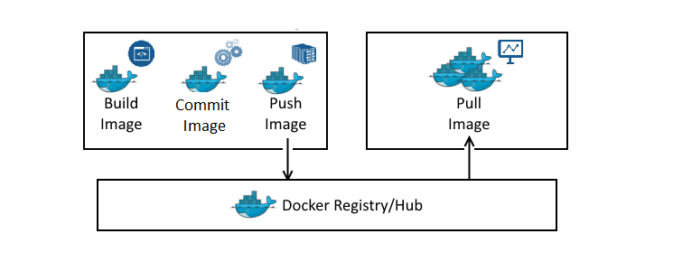

# Giới thiệu Docker
## 1.Docker là gì
Docker là nền tảng cung cấp cho các công cụ, service để các developers, adminsystems có thể phát triển, thực thi, chạy các ứng dụng với containers. Hay nói một cách khác nó là một nền tảng để cung cấp cách để building, deploy và run các ứng dụng một cách dễ dàng trên nền tảng ảo hóa - "Build once, run anywhere". Hay nói một cách dễ hiểu như sau: Khi chúng ta muốn chạy app thì chúng ta phải thiết lập môi trường chạy cho nó. Thay vì chúng ta sẽ đi cài môi trường chạy cho nó thì chúng ta sẽ chạy docker.
## 2. Đặc điểm chính của Docker
- Mỗi container được xem như là 1 sandbox, nơi cung cấp 1 môi trường hoàn toàn cô lập với máy host và các container khác.
- Mỗi 1 container sẽ chứa các resource được ảo hóa như các tập lệnh của hệ điều hành, đơn vị xử lý (CPU), bộ nhớ (RAM), nơi lưu trữ (storage), cấu hình mạng (network).
- Docker cho phép kiểm soát việc sử dụng các resource được khai báo cho mỗi container như RAM, CPU, Storage, Network tối ưu việc sử dụng tài nguyên máy chủ.
- Mỗi container có thể tạo ra các Docker image (1 dạng snapshot cho container) nhằm mục đích tái sử dụng container này dễ dàng triển khai trên chủ mới.
- Ngoài ra, Docker còn cho phép phát triển theo chiều ngang (horizontal scale) cho các container thông qua swarm mode, từ đó tăng năng lực xử lý cho các service trong hệ thống. (các service phải được thiết kế theo hướng Decentralized).
## 3. Một số khái niệm khi sử dụng docker
### 3.1 Dockerfile
- Docker image có thể được tạo ra tự động bằng cách đọc các chỉ dẫn trong Dockerfile.
- Dockerfile mô tả ứng dụng và nó nói với docker cách để xây dựng nó thành 1 image.
 
### 3.2  Docker image
- Image trong docker còn được gọi là mirror, nó là 1 đơn vị đóng gói chứa mọi thứ cần thiết để 1 ứng dụng chạy.
- Ta có thể có được image docker bằng cách pulling từ image registry. Thao tác pulling sẽ tải image xuống máy chủ docker, nơi docker có thể sử dụng nó để chạy 1 hoặc nhiều container.
- Image được tạo thành từ nhiều layer xếp chồng lên nhau, bên trong image là 1 hệ điều hành bị cắt giảm và tất cả các phụ thuộc cần thiết để chạy 1 ứng dụng.
 
 ### 3.3  Registry
- Docker Registry là nơi lưu trữ các image với hai chế độ là private và public. ( Bách Khoa có 1 registry lưu trữ docker riêng là registry.s-erp.com.vn)
- Là nơi cho phép chia sẻ các image template để sử dụng trong quá trình làm việc với Docker
- Image được tạo thành từ nhiều layer xếp chồng lên nhau, bên trong image là 1 hệ điều hành bị cắt giảm và tất cả các phụ thuộc cần thiết để chạy 1 ứng dụng.
 
  ### 3.4  Docker container
- Một image có thể đước sử dụng để tạo 1 hoặc nhiều container. Ta có thể create, start, stop, move hoặc delete dựa trên Docker API hoặc Docker CLI.
 
- Trong mô hình container, hệ điều hành yêu cầu tất cả các tài nguyên phần cứng. Trên hệ điều hành, ta cài đặt container engine là docker. Sau đó, công cụ container sẽ lấy các tài nguyên hệ điều hành và ghép chúng lại thành các cấu trúc riêng biệt được gọi là container.
- Mỗi container bao gồm mọi thứ cần thiết để chạy được nó: code, runtime, system tools, system libraries, setting. Mỗi container như 1 hệ điều hành thực sự, bên trong mỗi container sẽ chạy 1 ứng dụng.
 
- Container và VM có sự cách ly và phân bổ tài nguyên tương tự nhưng có chức năng khác nhau vì container ảo hóa hệ điều hành thay vì phần cứng. Các container có tính portable và hiệu quả hơn.
- Container nhằm làm cho các ứng dụng trở nên dễ dàng xây dựng, di chuyển và chạy. Quá trình đưa 1 ứng dụng chạy trong container có để được hiểu như sau:
    1. Đầu tiên ta bắt đầu với code app và các phụ thuộc của nó
    2. Tạo Dockerfile mô tả ứng dụng, các phụ thuộc và cách chạy ứng dụng đó
    3. Bulid Dockerfile thành image
    4. Push image mới build vào registry(option)
    5. Chạy container từ image
 

## 4. Kiến trúc, các thành phần trong Docker
### 4.1. Các thành phần
Docker Engine là một ứng dụng client-server với các thành phần chính sau:
- Server hay còn được gọi là docker daemon chịu trách nhiệm tạo, quản lý các Docker object như: image, containers, networks, volume.
REST API được docker daemon sử dụng để cung cấp các api cho client sử dụng để thao tác với docker
- Client là thành phần đầu cuối cung cấp một tập hợp các câu lệnh sử dụng API để người dùng thao tác với Docker. VD: docker image, docker ps, docker network, ..

 

### 4.2. Kiến trúc Docker
Client sẽ sử dụng Docker REST API để tương tác với Docker daemon.

 

 - Docker client sử dụng kiến trúc client-server. Docker client sẽ giao tiếp với Docker daemon các công việc building, running và distributing các Docker container.
 - Docker daemon nghe các yêu cầu từ REST API và quản lý các đối tượng Docker như: Containers, Image, Networks và Volume. Một daemon cũng có thể liên lạc với các daemons khác để quản lý Docker services.
 - Docker registries để cho các docker image đăng ký lưu trữ qua Docker Hub để bạn hoặc người khác có thể kéo về 1 cách dễ dàng.

### 4.3 Một số lệnh cơ bản khi dùng với docker
Pull một image từ Docker Hub
```
docker pull {image_name}
```

Liệt kê các images hiện có
```
docker images
```

Xóa một image
```
docker rmi {image_id/name}
```

Liệt kê các container đang chạy
```
docker ps
```
```
docker ps -a #Liệt kê các container đã tắt
```

Xóa một container
```
docker rm -f {container_id/name}
```

Đổi tên một container
```
docker rename {old_container_name} {new_container_name}
```

Khởi động một container
```
docker start {new_container_name}
```
```
docker exec -it {new_container_name} /bin/bash
```

Tạo mới một container, đồng thời khởi động với tùy chọn cổng và volume
```
docker run --name {container_name} -p {host_port}:{container_port} -v {/host_path}:{/container_path} -it {image_name} /bin/bash
```

Xem các thay đổi trên container
```
docker diff {container_name}
```

Commit các thay đổi trên container và image
```
docker commit -m "message" {container_name} {image_name}
```

Save image thành file .tar
```
docker save {image_name} > {/host_path/new_image.tar}
```

Tạo một image mới từ file .tar
```
cat musashi.tar | docker import - {new_image_name}:latest
```

Xem lịch sử các commit trên image
```
docker history {image_name}
```

Khôi phục lại images từ IMAGE_ID
```
docker tag {iamge_id} {image_new_name}:{tag}
```

Build một image từ container
```
docker build -t {container_name} .
```
Dấu . ở đây ám chỉ Dockerfile đang nằm trong thư mục hiện tại.